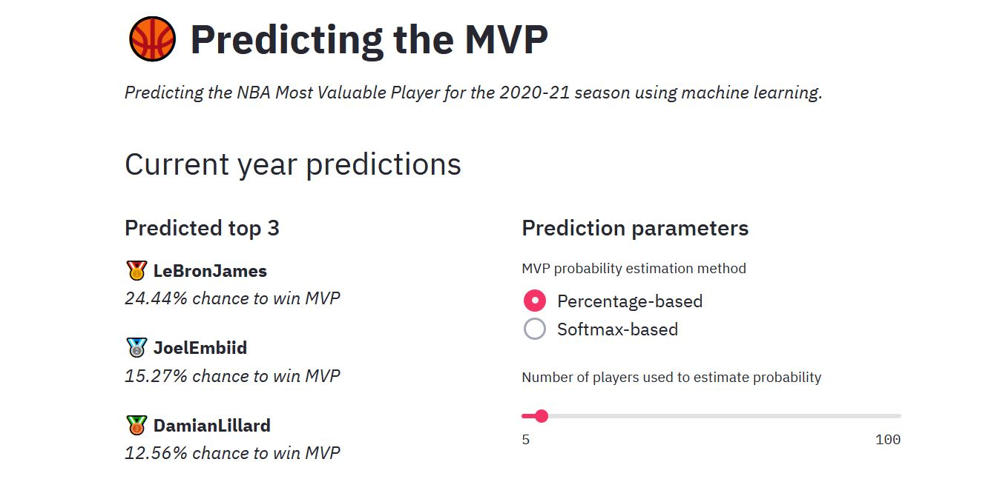

# Predicting the KIA MVP

Look for the result at [nbamvp.herokuapp.com](https://nbamvp.herokuapp.com)



## Development

```pipenv run mlflow ui```

```pipenv run streamlit run app_web.py```

```pipenv run python app_cli.py --help```

## Pain points and future work

Probleme anticipé :
- 1 vice MVP une année pourrait être MVP l'année d'avant. La concurrence est importante. C'est cela que vise à traiter la normalisation par saison. Ajouter un rank pour chaque stat pourrait aussi être pertinent.